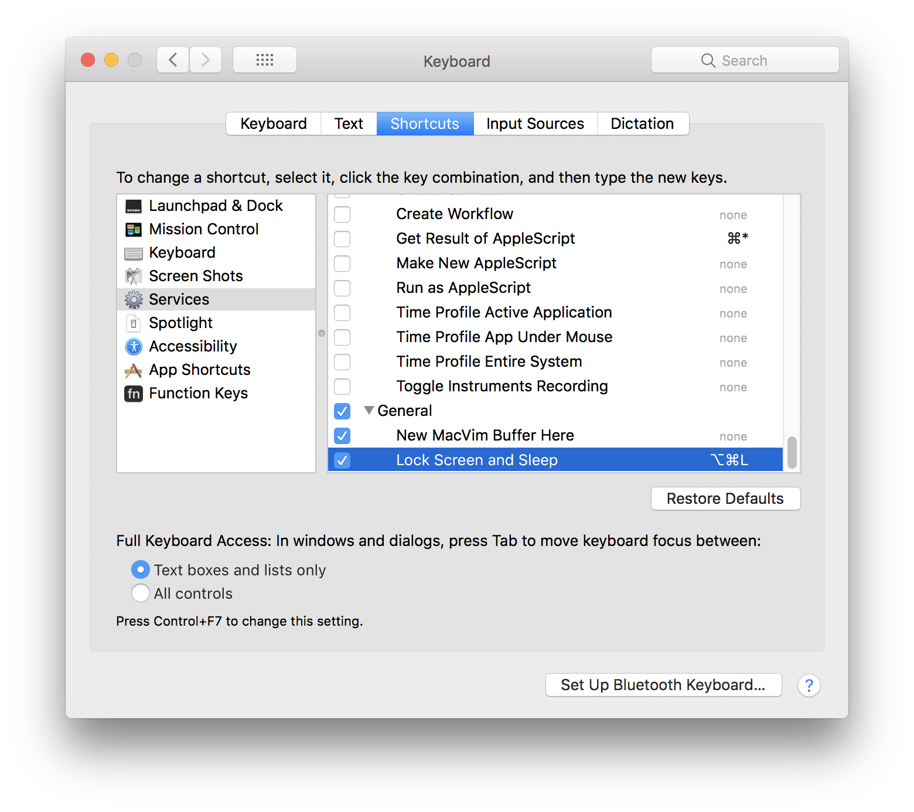

To compile and install to ~/bin

    make
    make install

At this point the new service "Lock Screen and Sleep" will appear in
all applications menu. You can configure a Keyboard Shortcut to this service now:

